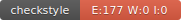

# UCE Génie Logiciel Avancé : Techniques de tests

# Nom et prénom :
* KANOUNI Abdelouahed

# Groupe : 
* ILSEN-ALT-Gr2

# CircleCI:

# Codecov

# Checkstyle

# Javadoc

Lien vers la documentation Javadoc : [Documentation Javadoc](https://abdelouahedkanouni.github.io/ceri-m1-techniques-de-test/fr/univavignon/pokedex/api/package-summary.html)

********************************************************************************************************************
## Rapport TP6
### Analyse de l'Implémentation :
* Génération Aléatoire : La méthode de génération aléatoire utilise une boucle
inefficace.
* Valeurs Arbitraires : Certaines valeurs sont fixées de manière arbitraire, ce qui peut
entraîner des résultats incohérents.
* Paramètres Non Utilisés : Certains paramètres ne sont pas pris en compte dans la
création du Pokémon.
* Carte Statique Non Modifiable : La carte statique utilisée pour mapper les index de
Pokémon à leurs noms est définie comme non modifiable.
* Gestion des Exceptions Manquante : Aucune gestion explicite des exceptions n'est
mise en place.
### Recommandations :

* Utiliser une méthode de génération aléatoire plus efficace.
- Calculer les statistiques du Pokémon en fonction des valeurs fournies pour cp,
  hp, dust et candy.
- Utiliser une carte modifiable pour mapper les index de Pokémon à leurs noms.
- Ajouter une gestion appropriée des exceptions pour gérer les erreurs
  potentielles.
- Mettre en place des tests automatisés pour couvrir ces scénarios et vérifier le
  comportement de l'implémentation dans différentes situations.

### Conclusion :
L'implémentation de RocketPokemonFactory présente des lacunes qui peuvent être
améliorées en suivant les recommandations émises dans ce rapport. Ces améliorations
permettront d'assurer une meilleure qualité et fiabilité de l'application.

********************************************************************************************************************

# la fin de chaque Tp (les noms de commit)
* TP1 : TP1
* TP2 : TP2 (Dés)intégration continue
* TP3 : TP3 : Pokéunit
* TP4 : TP4 successfully v5
* TP5 : FIN TP5 définitivement
* TP6 : FIN TP6
